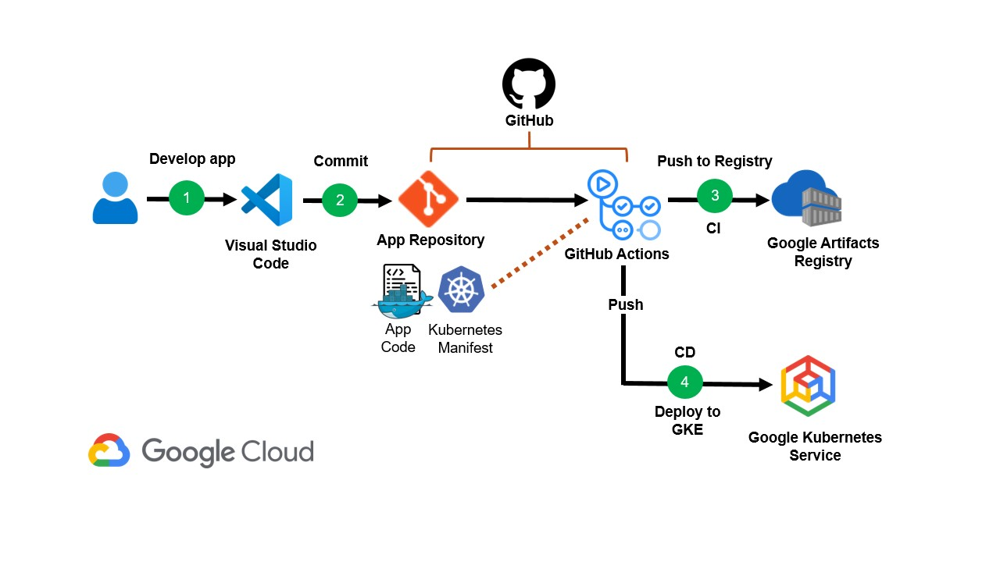
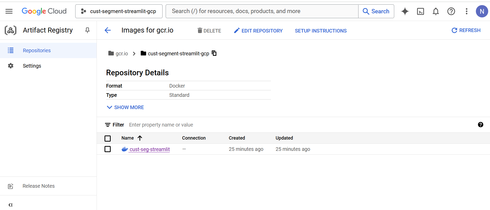
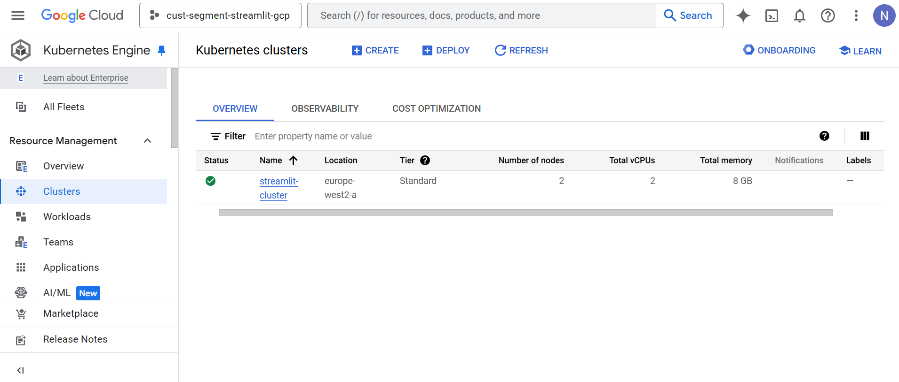
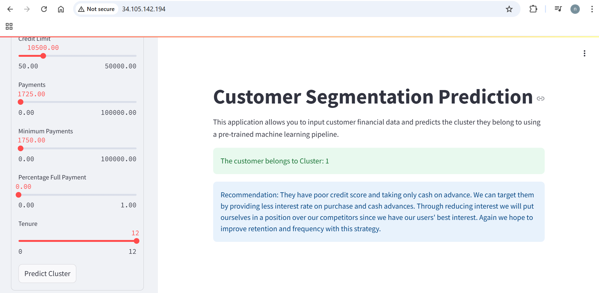
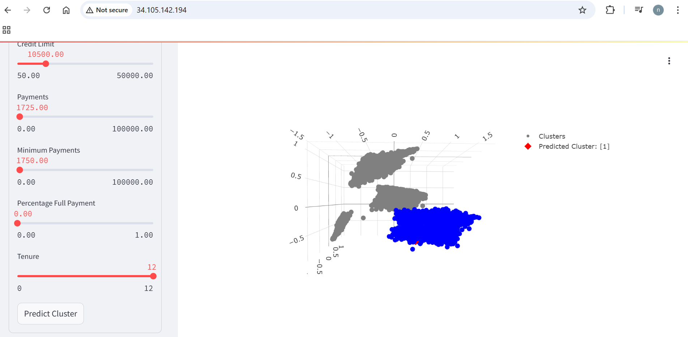

# **Scalable ML Model with Real-Time Inference Endpoint for Customer Segmentation**

## Overview

This repository showcases the development of a scalable machine learning model for customer segmentation, capable of handling real-time inference using streamlit. The project tackles the business challenge of segmenting customers using unstructured data to create tailored marketing strategies. The solution incorporates complex workflows such as data ingestion, transformation, model training, and deployment, leveraging modern tools like Docker, Kubernetes, and GitHub Actions.

## Business Problem

Customer segmentation is vital for businesses to understand and address the diverse needs of their customer base. By grouping customers based on their behaviors and characteristics, companies can tailor marketing efforts, enhancing customer engagement and retention. This project develops a machine learning model that segments customers and provides real-time predictions via streamlit app.

## Workflow

The project workflow includes several interconnected components:

* **1. Data Ingestion:** Load and prepare the customer dataset for analysis.
* **2. Data Transformation:** Clean and preprocess the data to make it suitable for model training.
* **3. Model Training:** Utilize PCA for dimensionality reduction and K-Means clustering algorithm to segment customers and determine the optimal number of clusters using Elbow Method with Silhouette validation.
* **4. Real-Time Inference with Streamlit:** Develop a streamlit app to provide real-time predictions.
* **5. Containerization with Docker:** Use Docker to containerize the streamlit application, ensuring consistent deployment across various environments.
* **6. Deployment with Kubernetes:** Deploy the containerized application to a Google Kubernetes Engine (GKE)cluster for scalability and high availability.
* **7. CI/CD Pipeline with GitHub Actions:** Automate the build and deployment process using GitHub Actions, enabling continuous integration and continuous deployment.


## Project Structure

```
.
├── .github/workflows       # GitHub Actions workflows
│   └── google.yaml         # Deployment configuration
├── artifacts               # Directory for storing artifacts like models
├── k8s                     
    └── k8s-deployment.yaml # Kubernetes service configuration
├── src                     # Source code for the application
│   ├── components          # Data ingestion, transformation, and model training
│   ├── pipeline            # Prediction pipeline
│   ├── exception           # exception handling
│   ├── logger              # logging function
│   ├── utils               # Utility functions
├── Dockerfile              # Docker configuration file       
├── requirements.txt        # Python dependencies
├── app.py                  # Streamlit application
└── README.md               # Project description
```
## Key Technologies

* **Docker:** Containerization tool for creating consistent deployment environments.

* **Kubernetes:** Orchestrates deployment, scaling, and management of containerized applications.

* **GitHub Actions:** Automates the CI/CD pipeline for continuous integration and deployment.

* **Google Cloud Platform:** Used Google Artifacts Registry for storing Docker images and Google Kubernetes Service (GKE) for hosting the application.

* **Streamlit:** Developed a user-friendly interface to test the model in real-time.



## Conclusion

This project provides an end-to-end solution for scalable customer segmentation with real-time inference capabilities. By leveraging modern tools and technologies, the model is robust, scalable, and easy to deploy, helping businesses tailor their marketing strategies effectively.